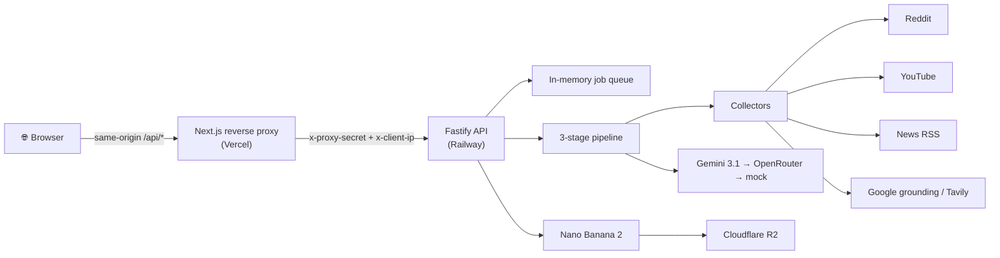
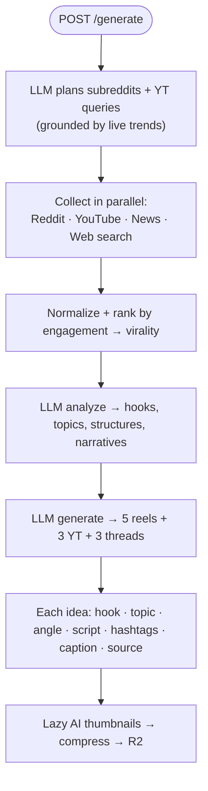

<div align="center">

# ⚡ Kairos — Backend

### AI engine that turns live crypto signals into viral content ideas

Collect viral crypto content → find the patterns → generate ready-to-film ideas, scripts, hooks & hashtags.

[](https://fastify.dev)
[](https://www.typescriptlang.org)
[](https://nodejs.org)
[](https://railway.app)
[](https://ai.google.dev)

**Frontend repo →** [`kairosFrontend`](https://github.com/Iglxkardam/kairosFrontend)

</div>

---

## ✨ What it does

A single request runs a 3-stage AI pipeline and returns structured content ideas:

| Stage | What happens |
| --- | --- |
| 🔭 **Collect** | Pulls high-engagement posts from **YouTube, Reddit, crypto news (RSS)** + live **Google-grounded web search**. Ranks everything by real engagement. |
| 🛰️ **Analyze** | An LLM extracts reusable **viral hooks, hot topics, storytelling structures, trending narratives** — bullish *and* bearish (no positivity bias). |
| ✨ **Generate** | Produces **5 Instagram reels + 3 YouTube videos + 3 Twitter threads**, each with hook, topic, angle, a beat-by-beat script, hashtags & a ready caption. |
| 🖼️ **Bonus** | AI **thumbnails** (Nano Banana 2) using the creator's real face, compressed to WebP and served from Cloudflare R2. |

> Everything is **grounded in real fetched data** to keep ideas accurate and hallucination low. If no LLM key is set, it falls back to deterministic mock output so the demo always runs.

---

## 🏗️ Architecture



### Pipeline flow



---

## 🧠 Design decisions

- **Agentic, but grounded** — the LLM *decides where to look* (subreddits, search queries), while code does the actual fetching for reliability + real engagement numbers. Web-search grounding is **not optional**; it's what keeps output accurate.
- **Async jobs** — `/generate` returns a `jobId` instantly and runs in the background, so a mid-run page reload never loses the result (the client polls `/job/:id`). Also dodges serverless timeouts.
- **Swappable LLM** — OpenAI-compatible: Gemini 3.1 Flash-Lite (primary) → DeepSeek via OpenRouter (fallback) → deterministic mock (last resort). Driven entirely by env.
- **No database** — this is a stateless idea-generator; run state lives in an in-memory job map, history lives in the browser. Keeps the system simple and the assignment focused.
- **Defense in depth** — the backend is only reachable through the frontend proxy (shared secret); a per-IP + global rate limiter caps cost even under a distributed attack.

---

## 🔌 API

| Method | Route | Purpose |
| --- | --- | --- |
| `POST` | `/generate` | Start a run → `{ jobId }`. Rate-limited: **1 completed run / 10 min per IP**. |
| `GET` | `/job/:id` | Poll a job → `{ status, result?, error? }`. |
| `POST` | `/thumbnail` | Lazy AI thumbnail for one idea → `{ url, usage? }`. |
| `GET` | `/health` | Liveness (open, no secret). |

All routes except `/health` require the `x-proxy-secret` header — so only the frontend proxy can reach them.

---

## 🚀 Run locally

```bash
pnpm install
cp .env.example .env      # fill in keys (or leave empty for mock mode)
pnpm dev                  # http://127.0.0.1:8080
```

> Zero keys? It still runs — collectors that need no key (Reddit RSS, News) work, and the LLM falls back to mock output.

### Verify

```bash
pnpm build                # type-check
curl http://127.0.0.1:8080/health
```

---

## 🔑 Environment

Copy `.env.example` → `.env`. Everything is optional — missing keys degrade gracefully.

| Var | What it's for |
| --- | --- |
| `PORT` | Server port (Railway sets this automatically). |
| `PROXY_SECRET` | Shared secret — must match the frontend. Gates the whole API. |
| `GEMINI_API_KEY` | Primary LLM **+** grounding **+** image generation. |
| `OPENROUTER_API_KEY` | Fallback LLM (DeepSeek). |
| `YOUTUBE_API_KEY` | YouTube Data API (source). |
| `SEARCH_API_KEY` | Tavily — fallback for web-search grounding. |
| `REDDIT_CLIENT_ID` / `REDDIT_CLIENT_SECRET` | App-only OAuth so Reddit works from datacenter IPs (falls back to public JSON / RSS). |
| `NEWS_FEEDS` | Comma-separated crypto RSS feeds. |
| `R2_*` | Cloudflare R2 (S3-compatible) to host generated thumbnails. |
| `IMAGE_MODEL` / `REFERENCE_DIR` | Nano Banana 2 model + folder of the creator's reference photos. |

---

## ☁️ Deploy to Railway

1. **New Project → Deploy from GitHub repo** → pick this repo.
2. Railway auto-detects Node + `pnpm` and runs `pnpm start` (see `railway.json`, health check on `/health`).
3. Add the env vars above in **Variables**. Set `FRONTEND_ORIGIN` to your Vercel URL.
4. Copy the generated public URL → set it as `BACKEND_URL` in the frontend (Vercel).

---

## 📁 Structure

```
src/
  server.ts        fastify app, routes, rate-limit + proxy-secret gate
  pipeline.ts      orchestrates research → analyze → generate
  research.ts      agentic plan + parallel collection + ranking
  analyze.ts       LLM pattern extraction
  generate.ts      LLM idea generation (lenient parsing, mock fallback)
  llm.ts           swappable OpenAI-compatible client + usage tracking
  image.ts         Nano Banana 2 thumbnails → sharp → R2 (dedupe + concurrency cap)
  jobs.ts          in-memory job store
  ratelimit.ts     per-IP + global cost circuit-breakers
  sources/         reddit · youtube · news · websearch (grounding)
```

---

<div align="center">
<sub>Built for The Sujal Show — AI Engineer assignment.</sub>
</div>
